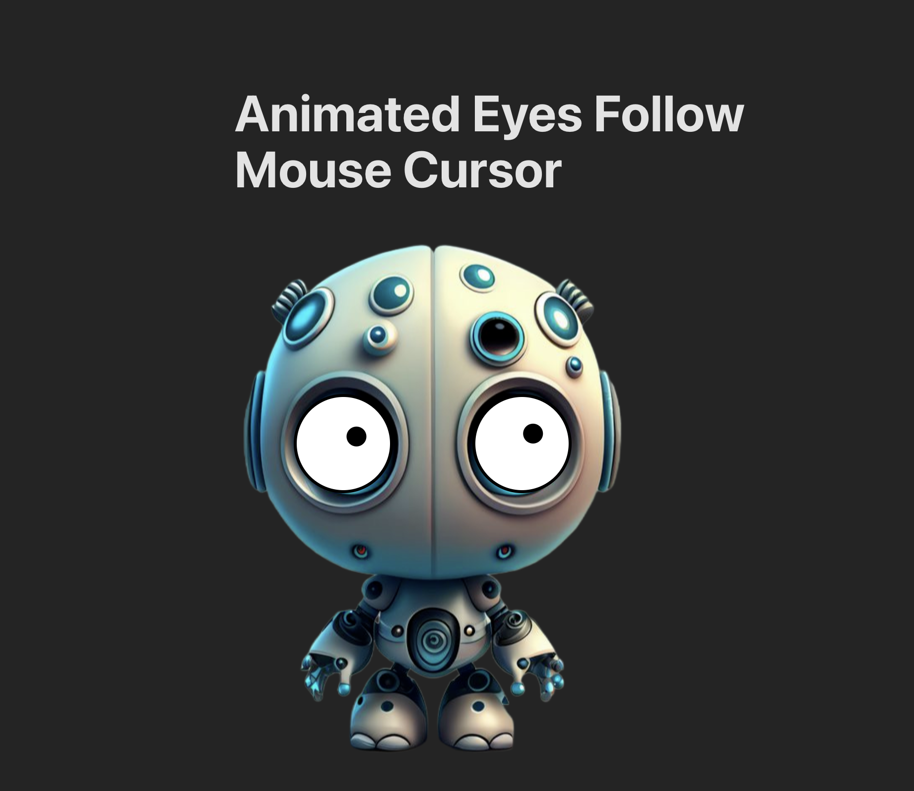

# Eyes Follow Mouse Cursor

This project aims to create animated eyes that follow the mouse cursor. The eyes are designed to look towards the cursor.

## Screenshots




## Technologies Used

React: JavaScript library for building user interfaces.
TypeScript: A superset of JavaScript that adds static typing and other features.
Vite: A fast build tool that focuses on providing a seamless development experience for modern web projects.


## Installation

To run the project locally, follow these steps:

1. Clone the project:

   ```bash
   git clone https://github.com/isinsuatay/ReactJs-Typscript-EyesFollowMouseCursor.git

Navigate to the project directory:

```
cd eyes-follow-mouse
```

Install dependencies:

```
npm install

```

Start the project:

```
npm run dev
```

